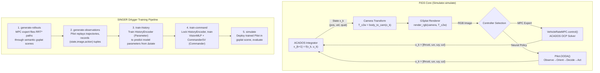

# AGENT_CONTEXT.md — Cognitive Map for `LEAD`

> **Last updated:** 2026-03-03
> **Purpose:** Context injection for AI agents. Read this file FIRST to understand the architecture before modifying any code.
> **Note:** This workspace was previously named `drone_autonomy`. All references to that name are outdated.

---

## 1. High-Level Summary

| Field | Value |
|---|---|
| **Workspace Name** | `LEAD` (formerly `drone_autonomy`) |
| **Host** | `coruscant`, user: `kothari1`, path: `/home/kothari1/autonomy_projects/LEAD/` |
| **Languages** | Python 3.10 (exclusively) |
| **Build System** | `setuptools` via `pyproject.toml` (editable installs, no CMake/Catkin) |
| **Middleware** | None (no ROS). Pure Python simulation with ACADOS for optimal control |
| **Solver** | ACADOS + CasADi (OCP/integration), HPIPM (QP sub-solver) |
| **Rendering** | Nerfstudio + gsplat (Gaussian Splatting) |
| **ML Framework** | PyTorch |
| **Containerization** | Docker (no sudo needed — `kothari1` is in `docker` group). GPU via `deploy.resources.reservations.devices` syntax (NOT `runtime: nvidia`) |
| **Data Path** | `/data/kothari1/singer_figs_data` |
| **Storage Warning** | `/home/kothari1` is at **100% capacity** — all large data, videos, images, and model outputs MUST go to `/data/kothari1/singer_figs_data/`. Key directories have been symlinked: `FiGS-Standalone/3dgs` → `/data/kothari1/singer_figs_data/3dgs` and `SINGER/cohorts` → `/data/kothari1/singer_figs_data/rollouts_singer`. Symlinks are reversible: delete symlink, move data back. |

### Core Purpose

- **FiGS-Standalone** (*"Flying in Gaussian Splats"*, package name: `figs`):  
  The **base simulation and control library**. Provides a physics-accurate quadcopter simulator that flies through 3D Gaussian Splat environments. Contains the dynamics model (CasADi ODE), body-rate MPC controller (ACADOS solver), trajectory generation (min-snap splines, RRT*), Gaussian Splat rendering (nerfstudio/gsplat), and the main simulation loop. Think of this as the "physics engine + renderer + expert controller."

- **SINGER** (*"Scene Understanding via Synthesized Visual Inertial Data from Experts"*, package name: `sousvide`):
  The **learned autonomy layer** built on top of FiGS. Adds neural network control policies (vision-language navigation) that learn from expert MPC demonstrations via DAgger-style imitation learning. Contains the Pilot (OODA-loop neural controller), policy architectures (SVNet, HPNet, etc.), data synthesis pipeline (rollout generation → observation extraction → training), CLIPSeg-based semantic perception, and deployment/evaluation scripts.

- **Semantic_HSM** (`Semantic_HSM/`):
  Two roles: (1) **Training** — `scripts/train_03.py` trains `VisualNavPolicy_Sequence` (MobileNetV3-Small + GRU) on SINGER validation rollout data (5-channel: RGB + depth + semantic). (2) **Deployment** — `sim/` is a standalone simulation package that is an **alternative to SINGER's deploy pipeline**. It adds a rule-based warm-up state machine (`STABILIZE → SCAN → CENTER → NAVIGATE`) that brings the drone to a safe altitude, locates the semantic target by 360° scan, centres it in the FOV, and only then fires the `VisualNavPolicy_Sequence` with a pre-populated history buffer. This avoids the cold-start `COLLISION_BOUNDS` failure in `simulate_v2c_adi.py`.
  Key files: `sim/v2c_env.py` (rendering + kinematics), `sim/v2c_brain.py` (state machine + policy), `sim/simulate.py` (CLI), `scripts/v2c_model_03.py` (policy architecture), `scripts/trained_models/t5_altframes_seq_final_model.pth` (checkpoint).

---

## 2. System Architecture & The "Boundary"

### Entry Points

| Entry Point | Location | Purpose |
|---|---|---|
| `figs_simulate_flight_example.py` | `FiGS-Standalone/notebooks/` | FiGS-only: Simulate MPC expert flying a course in a gsplat scene |
| `figs_generate_3dgs_example.py` | `FiGS-Standalone/notebooks/` | Process video → COLMAP → train 3DGS → export splat |
| `ssv_multi3dgs_campaign.py` | `SINGER/notebooks/` | **Primary SINGER CLI** (typer app) with subcommands: `generate-rollouts`, `generate-observations`, `train-history`, `train-command`, `simulate`, `debug-trajectory` |
| `ssv_multi3dgs.yml` | `SINGER/configs/experiment/` | Experiment config (cohort name, method, flights, roster, training epochs) |
| `simulate_v2c_adi.py` | `SINGER/notebooks/` | Standalone V2C policy deployment (monolithic, kept as baseline reference) |
| `simulate.py` | `Semantic_HSM/sim/` | **V2C state-machine CLI** — warm-up (STABILIZE→SCAN→CENTER) then policy; alternative to `simulate_v2c_adi.py` |
| `train_03.py` | `Semantic_HSM/scripts/` | Trains `VisualNavPolicy_Sequence` on SINGER validation rollout data |

### SINGER → FiGS Integration (The Boundary)

SINGER depends on FiGS as a **Python package dependency** (not linked C++ libraries). The integration is purely through Python imports:

```
sousvide.synthesize.rollout_generator  →  figs.simulator.Simulator
                                       →  figs.control.vehicle_rate_mpc.VehicleRateMPC
                                       →  figs.dynamics.model_specifications.generate_specifications

sousvide.flight.deploy_figs            →  figs.simulator.Simulator
                                       →  figs.control.vehicle_rate_mpc.VehicleRateMPC
                                       →  figs.tsplines.min_snap
                                       →  figs.utilities.trajectory_helper
                                       →  figs.dynamics.model_specifications.generate_specifications
                                       →  figs.visualize.generate_videos

sousvide.flight.deploy_ssv             →  figs.simulator.Simulator
                                       →  figs.dynamics.model_specifications.generate_specifications
                                       →  figs.scene_editing.scene_editing_utils
                                       →  figs.tsplines.min_snap
                                       →  figs.utilities.trajectory_helper
```

**Key architectural fact:** SINGER's `Pilot` class does NOT inherit from FiGS's `BaseController`. Instead, both expose a `.control(tcr, xcr, upr, obj, icr, zcr)` method with the same signature. The `Simulator.simulate()` method is polymorphic — it accepts any object with a compatible `.control()` interface and a `.hz` attribute. This is a **duck-typing contract**, not an inheritance hierarchy.

### Docker Integration

```
┌──────────────────────────────────────────────┐
│         figs:latest  (Docker Image)          │
│  Built from: FiGS-Standalone/Dockerfile.FiGS │
│  Contains: Python 3.10, PyTorch 2.1.2+CUDA, │
│            nerfstudio, gsplat, ACADOS,       │
│            numpy 1.26.4, CasADi              │
├──────────────────────────────────────────────┤
│  SINGER docker-compose.yml uses figs:latest  │
│  Bind-mounts:                                │
│    ./                  → /workspace/SINGER   │
│    ../FiGS-Standalone  → /workspace/FiGS-... │
│    ../Semantic_HSM     → /workspace/Semantic_HSM │
│    DATA_PATH           → same path in container │
│  Editable installs: figs, gemsplat, sousvide │
│  Persists: site-packages named volume        │
└──────────────────────────────────────────────┘

GPU access uses the modern compose syntax (deploy.resources.reservations.devices).
The legacy `runtime: nvidia` key is NOT supported on this host and will error.

To start containers:
  FiGS:   cd FiGS-Standalone && docker compose -f docker-compose.base.yml run --rm figs
  SINGER: cd SINGER && docker compose run --rm singer

Both repos have a .env file setting DATA_PATH=/data/kothari1/singer_figs_data.
SINGER .env also sets FIGS_PATH=../FiGS-Standalone.
Semantic_HSM is mounted via SEMANTIC_HSM_PATH (defaults to ../Semantic_HSM).
```

### Data Flow / Control Loop



### State Vector & Control Input

The quadcopter ODE model (`model_equations.py`) defines:

| Symbol | Indices | Description |
|--------|---------|-------------|
| **x** (10-dim) | `[0:3]` = `[px, py, pz]` | Position (world frame) |
| | `[3:6]` = `[vx, vy, vz]` | Velocity (world frame) |
| | `[6:10]` = `[qx, qy, qz, qw]` | Orientation quaternion (Hamilton convention) |
| **u** (4-dim) | `[0]` = `uf` | Normalized collective thrust (range: [-1, 0]) |
| | `[1:4]` = `[ωx, ωy, ωz]` | Body rates (rad/s, range: ±5.0) |

Dynamics: `ṗ = v`, `v̇ = g + (tn·uf/m)·R(q)·e₃`, `q̇ = ½·q⊗ω` (quaternion kinematics).

---

## 3. Map of Key Components

### Simulation Engine (FiGS)

| File | Primary Responsibility | Key Algorithms | Cross-Boundary Dependencies |
|------|----------------------|----------------|---------------------------|
| `src/figs/simulator.py` (1542 lines) | Core simulation loop. Instantiates gsplat scene, loads drone frame/rollout config, runs time-stepped simulation calling controller + renderer each step. | ACADOS IRK integrator for physics, image capture at controller frequency, noise injection (model + sensor), sensor-model fusion | Loaded by SINGER's `rollout_generator.py`, `deploy_figs.py`, `deploy_ssv.py` |
| `src/figs/dynamics/model_equations.py` | CasADi symbolic quadcopter ODE model. Exports ACADOS-compatible model. | Quaternion-based 6-DOF rigid body dynamics with normalized thrust | Used by `VehicleRateMPC.__init__()` |
| `src/figs/dynamics/model_specifications.py` | Converts raw drone params dict → full specification dict with derived constants (inertia inverse, force-to-moment matrix, etc.) | Motor mixing matrix `fMw`, inverse `wMf` | Used by SINGER's `rollout_generator.py`, `deploy_figs.py`, `deploy_ssv.py` |
| `src/figs/control/base_controller.py` | Abstract base class defining the controller interface: `.control(tcr, xcr, upr, obj, icr, zcr) → (ucr, zcr, adv, tsol)`. Also provides `load_json_config()`. | Interface only (ABC) | Inherited by `VehicleRateMPC` |
| `src/figs/control/vehicle_rate_mpc.py` (384 lines) | Body-rate MPC expert controller. Formulates and solves an ACADOS OCP at each timestep to track a reference trajectory. | Nonlinear MPC with ACADOS, Gauss-Newton Hessian, PARTIAL_CONDENSING_HPIPM QP solver, IRK integration, min-snap reference trajectory | Used by SINGER as "expert" in DAgger |
| `src/figs/tsplines/min_snap.py` | Minimum-snap trajectory optimization from keyframe waypoints. | Polynomial spline optimization (flat output: position + yaw) with continuity constraints | Used by `VehicleRateMPC`, SINGER's `deploy_figs.py` |
| `src/figs/tsampling/build_rrt_dataset.py` (2068 lines) | Generates collision-free RRT* trajectories through gsplat scenes toward semantic objectives. | RRT* path planning, semantic point cloud segmentation (CLIP features), obstacle detection, trajectory smoothing | Uses `gsplat_semantic.GSplat`, `scene_editing_utils`, `trajectory_helper` |
| `src/figs/tsampling/rrt_datagen_v10.py` | Core RRT* algorithm implementation (step size, bounded/exact stepping, edge overlap prevention). | RRT* sampling, nearest-neighbor search, path rewiring | Used by `build_rrt_dataset.py` |
| `src/figs/render/gsplat.py` | Basic GSplat renderer (RGB only). Wraps nerfstudio pipeline for inference-mode rendering from arbitrary camera poses. | Nerfstudio `eval_setup`, perspective camera model, world-to-gsplat coordinate transform (`T_w2g`) | Used by `Simulator` |
| `src/figs/render/gsplat_semantic.py` (683 lines) | Extended GSplat renderer with semantic capabilities. Renders RGB + semantic similarity maps, generates colored point clouds, supports CLIP-based object queries. | CLIP feature extraction, semantic similarity scoring, point cloud generation with alpha/scale culling | Used by `build_rrt_dataset.py`, `deploy_ssv.py` |
| `src/figs/utilities/trajectory_helper.py` (63KB) | Trajectory conversion utilities. Converts between spline (T,CP) and time-series (tXU) representations. Contains quaternion math, flat-output differentiation, debug plotting. | Spline evaluation, differential flatness (position → quaternion via thrust direction), quaternion interpolation | Used extensively by both FiGS and SINGER |
| `src/figs/scene_editing/scene_editing_utils.py` (35KB) | Point cloud manipulation, obstacle geometry, scene editing for RRT planning. | 3D point cloud filtering, bounding box operations, ring/obstacle geometry for RRT | Used by `build_rrt_dataset.py`, SINGER's `deploy_ssv.py` |

### Neural Policy & Control (SINGER)

| File | Primary Responsibility | Key Algorithms | Cross-Boundary Dependencies |
|------|----------------------|----------------|---------------------------|
| `src/sousvide/control/pilot.py` (380 lines) | **OODA-loop neural controller.** Manages observation history, state preprocessing, neural network inference, and control output. | OODA loop: Observe (buffer state/image), Orient (compute delta transforms ΔxΔu), Decide (extract NN inputs), Act (forward pass → control). Data augmentation (additive noise). | Imports `generate_networks.py` (internal) |
| `src/sousvide/control/policies/svnet.py` | **SVNet** — primary policy architecture. Three-module design: HistoryEncoder + VisionMLP + CommanderSV. | HistoryEncoder: MLP encoder-decoder on Δstate/Δcontrol history. VisionMLP: CNN backbone (SqueezeNet/DINOv2/CLIPSeg) + state-conditioned MLP. CommanderSV: MLP that fuses state + objective + history encoding + vision encoding → control output. | Imports `ComponentNetworks` |
| `src/sousvide/control/policies/ComponentNetworks.py` (408 lines) | Reusable network building blocks: `HistoryEncoder`, `DirectHistoryEncoder`, `CommandHP`, `CommandSV`, `CommandSVNoRMA`, `VisionMLP`, `VisionCNN`. | MLP with optional dropout, CNN backbones (SqueezeNet1_1, DINOv2, CLIPSeg), encoder-decoder architectures | Imports `BaseNetworks` |
| `src/sousvide/control/policies/BaseNetworks.py` (14KB) | Low-level network primitives: MLP builder, CNN backbone wrappers, CLIPSeg encoder integration. | `SimpleMLP`, `VisionCNN` wrapping torchvision models, `CLIPSegSoftmaskEncoder` | — |
| `src/sousvide/control/policies/generate_networks.py` | Factory functions: `policy_factory()` and `advisor_factory()`. Creates/loads policy models from config + checkpoint path. Handles model migration (old `controller.*` → `sousvide.control.*` module aliasing). | Factory pattern, module aliasing for legacy checkpoint compatibility, selective weight transfer (HistoryEncoder preservation during retraining) | — |
| `src/sousvide/control/policies/hpnet.py` | **HPNet** — simpler policy variant (HistoryEncoder + CommandHP, no vision). | Same as SVNet but without VisionMLP module | — |
| `src/sousvide/control/policies/svnet_no_rma.py` | **SVNetNoRMA** — SVNet variant without history/RMA (Rapid Motor Adaptation). | VisionMLP + CommandSVNoRMA only | — |
| `src/sousvide/control/policies/svnet_direct.py` | **SVNetDirect** — variant with direct history encoding. | DirectHistoryEncoder (no encoder-decoder bottleneck) | — |

### Data Synthesis Pipeline (SINGER)

| File | Primary Responsibility | Key Algorithms | Cross-Boundary Dependencies |
|------|----------------------|----------------|---------------------------|
| `src/sousvide/synthesize/rollout_generator.py` (1240 lines) | Generates expert demonstration data. Flies MPC expert through gsplat scenes with domain randomization (perturbed initial states, varied drone frames). | DAgger-style data collection, domain randomization (mass ± 0.3, force_norm ± 0.3), RRT* trajectory sampling, loiter spin splicing, min-snap trajectory smoothing | **Heavy FiGS dependency**: `figs.simulator.Simulator`, `figs.control.vehicle_rate_mpc.VehicleRateMPC`, `figs.dynamics.model_specifications` |
| `src/sousvide/synthesize/observation_generator.py` (241 lines) | Replays expert trajectories through the Pilot's observation pipeline. Produces `(state, image, expert_action)` tuples for supervised training. | Trajectory replay, Pilot observation pipeline (with data augmentation), subsampling | Imports `Pilot` |
| `src/sousvide/synthesize/data_utils.py` | Data loading/saving utilities for trajectory and observation data. | Torch tensor serialization, video I/O | — |
| `src/sousvide/instruct/train_policy.py` (285 lines) | Training loop for the neural policy. Supports staged training: "Parameter" (HistoryEncoder only), then "Commander" (VisionMLP + CommanderSV with locked HistoryEncoder). | Staged DAgger training, selective network freezing via `unlock_networks()`, MSE loss, wandb logging | Imports `Pilot`, `synthesized_data` |
| `src/sousvide/instruct/synthesized_data.py` (267 lines) | PyTorch Dataset wrapper for observation data. Handles data path management, train/test splitting, and data loading for the training pipeline. | Custom `ObservationData` Dataset, per-course data splitting | Imports `Pilot` |

### Perception (SINGER)

| File | Primary Responsibility | Key Algorithms |
|------|----------------------|----------------|
| `src/sousvide/flight/vision_preprocess.py` (508 lines) | CLIPSeg-based semantic perception. Generates semantic probability maps from RGB images given text queries. | CLIPSeg HuggingFace inference (`CIDAS/clipseg-rd64-refined`), global rescaling, superpixel smoothing (SLIC), GPU-accelerated overlay blending, SSIM-based scene change detection, optical flow mask warping |
| `src/sousvide/flight/vision_preprocess_alternate.py` (48KB) | Alternate vision preprocessing pipeline (primary one used in `deploy_ssv.py`). Extended version with additional perception backends. | Multiple vision backends, extended preprocessing |

### Deployment & Evaluation (SINGER)

| File | Primary Responsibility | Cross-Boundary Dependencies |
|------|----------------------|---------------------------|
| `src/sousvide/flight/deploy_figs.py` (138 lines) | Simulates a roster of pilots (expert + neural) on a fixed course in a single gsplat scene. Saves trajectory data + videos. | `figs.simulator.Simulator`, `figs.control.vehicle_rate_mpc.VehicleRateMPC`, `figs.tsplines.min_snap`, `figs.dynamics.model_specifications` |
| `src/sousvide/flight/deploy_ssv.py` (624 lines) | Full semantic scene understanding deployment. Runs pilots across multiple scenes/objects with RRT* trajectories. Handles multi-3DGS campaign evaluation. | `figs.simulator.Simulator`, `figs.dynamics.model_specifications`, `figs.scene_editing.scene_editing_utils`, `figs.tsplines.min_snap`, `figs.utilities.trajectory_helper` |
| `src/sousvide/flight/command_helper.py` | Helper for constructing objective vectors from trajectory splines. | — |
| `src/sousvide/flight/zed_command_helper.py` (23KB) | ZED camera integration for real-world deployment. | ZED SDK, real-time state estimation |
| `src/sousvide/visualize/plot_flight.py` (73KB) | Comprehensive flight visualization and analysis. | Plotly 3D trajectory plots, performance metrics |
| `src/sousvide/visualize/record_flight.py` | FlightRecorder class for saving flight data (mirrors real-world deployment format). | — |

---

## 4. Critical State & Configuration

### Configuration Directory Structure

Both repos share an identical config directory layout (JSON files unless noted):

```
configs/
├── capture/        # Camera hardware configs (intrinsics, resolution)
│   └── *.json      # e.g., iphone15pro.json, pixel8pro.json
├── course/         # Pre-defined trajectory waypoints (flat-output keyframes)
│   └── *.json      # e.g., track_spiral.json — keyframes with time + [x,y,z,ψ]
├── frame/          # Drone physical parameters
│   └── *.json      # e.g., carl.json — mass, inertia, arm geometry, camera transform
├── method/         # Experiment methodology (domain randomization bounds, etc.)
│   └── *.json      # e.g., rrt.json — sample_set, trajectory_set, frame_set, test_set
├── perception/     # Perception mode configuration
│   └── *.yml
├── policy/         # MPC tuning parameters
│   └── *.json      # e.g., vrmpc_br.json — hz, horizon, Q/R/QN weights, input bounds
└── rollout/        # Simulation environment settings
    └── *.json      # e.g., baseline.json — sim frequency, noise models, fusion weights
```

SINGER adds these additional config directories:

```
configs/
├── experiment/     # Top-level experiment YAML (cohort, method, flights, roster, Nep)
│   └── *.yml       # e.g., ssv_multi3dgs.yml
├── missions/       # Mission configs (e.g., missionSSV.json)
├── pilots/         # Neural policy architecture definitions
│   └── *.json      # e.g., InstinctJester.json — network topology, CNN backbone, state indices
├── scenes/         # 3DGS scene configs with semantic queries + RRT* parameters
│   └── *.yml       # e.g., flightroom_ssv_exp.yml — queries, radii, altitudes, RRT* params
└── rollout/        # Extended rollout profiles (additional noise levels)
    └── *.json      # baseline, assisted, challenged, extreme
```

### Key Physical Parameters (`configs/frame/carl.json`)

| Parameter | Value | Notes |
|-----------|-------|-------|
| Mass | 1.144 kg | |
| Massless Inertia | `[0.0194, 0.0194, 0.0368]` | Diagonal, multiplied by mass |
| Arm geometry | front: `[0.075, 0.100]`, back: `[0.075, 0.100]` | `[x, y]` meters from CoM |
| Normalized force gain | 6.90 | Total thrust = `fn × n_rotors × uf` |
| Torque gain | 0.040 | After normalizing by `fn` |
| Number of rotors | 4 | |
| Camera intrinsics | 640×360, fx=462.96, fy=463.00 | |
| Camera-to-body transform | `T_c2b` 4×4 matrix | Camera looks forward (-Z body) |

### MPC Tuning (`configs/policy/vrmpc_br.json`)

| Parameter | Value |
|-----------|-------|
| Control frequency | 20 Hz |
| Horizon length | 40 steps (2.0 s) |
| Input bounds | thrust ∈ [-1, 0], body rates ∈ [-5, 5] rad/s |
| State weights `Qk` | pos: 0.5, vel: 0.1, quat: 0.2 |
| Input weights `Rk` | thrust: 1.0, ωx/ωy: 0.1, ωz: 0.01 |

### Pilot Architecture (`configs/pilots/InstinctJester.json`)

| Component | Architecture | Key Config |
|-----------|--------------|------------|
| HistoryEncoder | MLP(hidden=[64,32], encoder=8, decoder=2) | 15 delta indices, 5 history frames |
| VisionMLP | SqueezeNet1_1 + MLP(hidden=[512,256], out=128) | State indices: [3, 7-10] (time + quaternion) |
| CommanderSV | MLP(hidden=[100,100], out=4) | State indices: [3-10] (time + vel + quat), no objective |

### Simulation Rollout Profiles

| Profile | Sim Hz | Model Noise Std | Sensor Noise Std |
|---------|--------|-----------------|------------------|
| `baseline` | 100 | All zeros | All zeros |
| `challenged` | 100 | All zeros | pos: 3.0, vel: 0.05, quat: 0.01 |

### Data Storage Layout

```
SINGER/cohorts/<cohort_name>/          (symlinked to /data/kothari1/singer_figs_data/rollouts_singer/)
├── rollout_data/
│   └── <scene>/                       # e.g., flightroom_ssv_exp/
│       ├── trajectories{id:05d}.pt    # Training: expert MPC trajectory (state x, control u, time t)
│       ├── imgdata{id:05d}.pt         # Training: per-frame semantic similarity tensors
│       ├── video{id:05d}.mp4          # Training: semantic heatmap video
│       ├── trajectories_val{id:05d}.pt # Validation: trajectory (no domain randomization)
│       ├── imgdata_val{id:05d}.pt     # Validation: per-frame semantic similarity tensors
│       ├── video_val_rollout_images_semantic{id:05d}.mp4  # Validation: semantic heatmap
│       ├── video_val_rollout_images_rgb{id:05d}.mp4       # Validation: raw RGB
│       └── video_val_rollout_images_depth{id:05d}.mp4    # Validation: depth (JET colormap)
├── observation_data/
│   └── <pilot_name>/
│       └── observations_{id:05d}.pt  # (state, image, expert_action) tuples for supervised training
└── roster/
    └── <pilot_name>/
        └── ...                        # Trained model checkpoints
```

**Batch count formula:**
- Training: `n_targets × n_branches × n_domain_rand_perturbations` (e.g., 3 × 11 × 10 = 330)
- Validation: `n_targets × n_branches` (e.g., 3 × 11 = 33, no domain randomization)

3DGS scene data lives at the path specified in `SINGER/.env` → `DATA_PATH`, currently set to: `/data/kothari1/singer_figs_data`.

### Global Coordinate Transforms

| Transform | Description |
|-----------|-------------|
| `T_w2g` | World → GSplat frame: `diag([1, -1, -1, 1])` (Y and Z axes flipped) |
| `T_c2b` | Camera → Body frame: defined per drone in `frame/*.json` |
| `T_c2w` | Camera → World: computed at runtime from state quaternion + `T_c2b` |

---

### Semantic_HSM — Training Scripts

| File | Primary Responsibility | Key Algorithms |
|------|----------------------|----------------|
| `Semantic_HSM/scripts/v2c_model_03.py` | `VisualNavPolicy_Sequence` — policy architecture | MobileNetV3-Small visual encoder + state encoder (MLP) + GRU temporal aggregator; 5-channel input (RGB+depth+semantic); outputs 7-dim goal prediction (dx,dy,dz,dyaw,dvx,dvy,dvz) + auxiliary velocity |
| `Semantic_HSM/scripts/train_03.py` | Training loop for `VisualNavPolicy_Sequence` — **runs on host, no Docker needed** | Loads validation rollout videos (RGB/depth/semantic) + trajectory `.pt` files; supervised training on position+yaw deltas; interactive matplotlib loss plot; graceful halt via SIGINT (Ctrl+C), `q`/`Esc` in plot window, or sentinel file (`touch STOP_TRAINING`) |
| `Semantic_HSM/scripts/benchmark_03.py` | Offline benchmark of trained policy | — |

### Semantic_HSM — sim/ (V2C State-Machine Deployment)

**Purpose:** Alternative to `SINGER/notebooks/simulate_v2c_adi.py`. Runs inside the SINGER container. Uses SINGER's FiGS Simulator and configs without replicating them.

| File | Primary Responsibility | Key Algorithms | Cross-Boundary Dependencies |
|------|----------------------|----------------|---------------------------|
| `Semantic_HSM/sim/v2c_env.py` | `V2CEnv` — rendering, kinematic step, bounds check | GemSplat CLIP query (identical logic to `simulate_v2c_adi.py`); `step()` integrates `vel_cmd + dyaw` into state vector; `check_bounds()` returns `"FLYING"/"OOB"` | `figs.simulator.Simulator`, `figs.dynamics.model_specifications`, `figs.utilities.trajectory_helper` |
| `Semantic_HSM/sim/v2c_brain.py` | `V2CBrain` — STABILIZE→SCAN→CENTER→NAVIGATE state machine + policy inference | P-controllers for altitude (STABILIZE) and yaw (CENTER); 360° semantic scan with peak detection; `VisualNavPolicy_Sequence` forward pass in NAVIGATE | `scripts.v2c_model_03.VisualNavPolicy_Sequence` |
| `Semantic_HSM/sim/simulate.py` | CLI orchestrator (~90 lines) | `while not brain.done` loop; `env.check_bounds` before render; `env.step` after `brain.act`; video saved to `sim/outputs/` | `V2CEnv`, `V2CBrain` |

**Critical design facts:**
- The original `simulate_v2c_adi.py` is **not modified** — both pipelines coexist.
- History buffer (`image_history`, `velocity_history`) is populated during SCAN and CENTER so NAVIGATE starts with a warm context.
- `SINGER_ROOT` and `FIGS_PATH` env vars control config/model paths inside Docker; both fall back to sibling directory conventions if unset.
- Output goes to `Semantic_HSM/sim/outputs/` (local, small files) rather than `SINGER/cohorts/`.

---

## 5. Build, Execution & Gotchas

### Build Instructions

```bash
# 1. Build FiGS base Docker image (one-time, ~20 min)
#    Already built on coruscant as of 2026-02-28 (figs:latest, 12.5GB)
cd FiGS-Standalone
git submodule update --init gemsplat
CUDA_ARCHITECTURES=$(nvidia-smi --query-gpu=compute_cap --format=csv,noheader | head -1 | tr -d '.') \
  docker compose build

# 2. Run FiGS-only environment
cd FiGS-Standalone
docker compose -f docker-compose.base.yml run --rm figs

# 3. Run SINGER development environment
cd SINGER
docker compose run --rm singer
# This auto-installs figs, gemsplat, and sousvide as editable packages
```

### Execution

```bash
# Inside the SINGER Docker container:

# Full training pipeline (DAgger)
python notebooks/ssv_multi3dgs_campaign.py generate-rollouts \
  --config-file configs/experiment/ssv_multi3dgs.yml
python notebooks/ssv_multi3dgs_campaign.py generate-observations \
  --config-file configs/experiment/ssv_multi3dgs.yml
python notebooks/ssv_multi3dgs_campaign.py train-history \
  --config-file configs/experiment/ssv_multi3dgs.yml
python notebooks/ssv_multi3dgs_campaign.py train-command \
  --config-file configs/experiment/ssv_multi3dgs.yml

# Evaluate
python notebooks/ssv_multi3dgs_campaign.py simulate \
  --config-file configs/experiment/ssv_multi3dgs.yml

# FiGS-only simulation (MPC expert)
python notebooks/figs_simulate_flight_example.py
```

### Gotchas, Edge Cases & Pitfalls

1. **Duck-typing controller contract:** `Pilot` does NOT extend `BaseController`. The `Simulator.simulate()` method uses duck typing — any object with `.control(tcr, xcr, upr, obj, icr, zcr)` and `.hz` attribute works. If you add a new controller, you must match this exact signature or the simulation loop will break silently with wrong argument ordering.

2. **ACADOS solver lifecycle:** The `VehicleRateMPC` constructor generates C code and compiles an ACADOS solver at init time (writes to `c_generated_code/` in CWD). You **must** `del ctl` after use to avoid ACADOS re-initialization errors. The FiGS notebook explicitly does this.

3. **Module aliasing for legacy checkpoints:** Old `.pth` checkpoints reference `controller.policies.*` instead of `sousvide.control.policies.*`. The `_alias_controller_to_control()` function in `generate_networks.py` handles this by injecting module aliases into `sys.modules`. If you rename or move policy classes, old checkpoints will fail to load.

4. **Paths in `.env`:**
   - `FIGS_PATH=../FiGS-Standalone` — SINGER expects FiGS to be a sibling directory
   - `SEMANTIC_HSM_PATH=../Semantic_HSM` — Semantic_HSM is also a sibling directory under `LEAD/`
   - `DATA_PATH=/data/kothari1/singer_figs_data` — nerf_data directory with trained 3DGS scenes
   - Both FiGS-Standalone and SINGER have `.env` files setting DATA_PATH

5a. **Perception mode config** (`FiGS-Standalone/configs/perception/perception_mode.yml`):
   - Controls what channels are rendered per simulation step and which video files are saved per rollout batch.
   - **Current setting (correct for Semantic_HSM training):** `visual_mode: semantic_depth` + `perception_type: similarity` → uses gemsplat's built-in CLIP rendering to produce RGB + depth (JET colormap) + semantic heatmap in one pass. In validation mode saves `video_val_rollout_images_rgb<id>.mp4`, `video_val_rollout_images_depth<id>.mp4`, `video_val_rollout_images_semantic<id>.mp4` per batch.
   - **Faster alternative:** `visual_mode: rgb` + `perception_type: similarity` → only semantic channel rendered, ~2–3× faster. Use for large production runs when depth/semantic videos are not needed.
   - **DO NOT use** `perception_type: clipseg` — this invokes CLIPSeg HuggingFace model per frame (slow, 1.26 GB download, causes bugs in the rendering pipeline). The `"similarity"` type uses gemsplat's native CLIP features and is equivalent but faster.

5b. **Symlinked large directories (storage management):**
   - `FiGS-Standalone/3dgs` → `/data/kothari1/singer_figs_data/3dgs` — all 3DGS workspace data (capture, training outputs) lives on the data drive. Works inside Docker because DATA_PATH is mounted at the same absolute path.
   - `SINGER/cohorts` → `/data/kothari1/singer_figs_data/rollouts_singer` — all cohort rollout/training output goes to the data drive.
   - **Reverting:** `rm <symlink>; mv /data/kothari1/singer_figs_data/<dir> <original_location>`

5c. **Available 3DGS models for `flightroom_ssv_exp` scene:**
   - **gemsplat (user-trained, preferred):** `/data/kothari1/singer_figs_data/3dgs/workspace/outputs/flightroom_ssv_exp/gemsplat/2026-02-28_205058/nerfstudio_models/step-000029999.ckpt`
   - **gemsplat (older, on data drive):** `/data/kothari1/singer_figs_data/trained_gsplats/flightroom_ssv_exp/gemsplat/2026-02-03_115017/nerfstudio_models/step-000028000.ckpt`
   - **splatfacto:** `/data/kothari1/singer_figs_data/3dgs/workspace/outputs/flightroom/splatfacto/2024-07-12_145513/nerfstudio_models/step-000029999.ckpt`
   - Simulator searches `FiGS-Standalone/3dgs/workspace/outputs/<scene>` first, then falls back to `$DATA_PATH/trained_gsplats/<scene>`.

5. **`configs_path` resolution:** `BaseController.__init__()` resolves configs relative to `__file__` (4 parents up from `base_controller.py`). This means config lookup differs based on whether you're running from FiGS or SINGER. SINGER's configs directory shadows FiGS's for shared config names.

6. **Quaternion convention:** The codebase uses Hamilton convention `[qx, qy, qz, qw]` (scalar-last) for the state vector, which differs from some robotics libraries that use scalar-first. The dynamics in `model_equations.py` are derived for this exact ordering.

7. **Normalized thrust:** The thrust control input `uf` is in range `[-1, 0]` (not [0, 1]). The actual thrust is `tn * uf / m` where `tn = fn * n_rotors`. Negative because the Z-axis convention has gravity pointing in +Z.

8. **`site-packages` Docker volume:** SINGER persists `/usr/local/lib/python3.10/dist-packages` as a named Docker volume. If you change Python dependencies in the base FiGS image, you **must** run `docker compose down -v` in SINGER to clear the cached packages.

9. **Vision preprocessing variants:** There are multiple `vision_preprocess*.py` files (original, alternate, alternate_backup, alternate_baseline). The active one used in `deploy_ssv.py` is `vision_preprocess_alternate.py`. The others are kept for reference/ablation.

10. **Training stages are order-dependent:** The DAgger pipeline MUST run in order: rollouts → observations → train-history → train-command. The "train-history" stage freezes the HistoryEncoder, and "train-command" trains VisionMLP + CommanderSV with the frozen encoder. Running out of order will produce a randomly initialized or incorrectly configured policy.

11. **Coordinate frame confusion risk:** There are 4 frames in play: World (w), GSplat/nerfstudio (g), Camera (c), and Body (b). The `T_w2g` transform flips Y and Z axes. Mixing these up will produce renders from wrong viewpoints. All controller computations happen in World frame; only rendering converts to GSplat frame.

12. **Large file sizes:** `trajectory_helper.py` (63KB), `build_rrt_dataset.py` (83KB), `deploy_ssv.py` (28KB), `plot_flight.py` (73KB), and `visualize_simulated_experiments.py` (96KB) are unusually large single files. Exercise care when modifying these — they contain significant state and complex logic.

13. **`Semantic_HSM/sim/` vs `simulate_v2c_adi.py`:** Both pipelines use the same `figs.simulator.Simulator` and the same `VisualNavPolicy_Sequence` policy, but `sim/` adds the warm-up state machine. **Do not merge or replace** `simulate_v2c_adi.py` — it is kept as a baseline reference. When reporting simulation results, note which pipeline was used.

14. **V2CBrain cold-start guard:** If SCAN completes without finding the object (`best_sem < scan_threshold`), `V2CBrain` transitions directly to NAVIGATE. In that case the policy fires from whatever scan history was collected — performance may be degraded but the simulation will not crash. Raise `scan_threshold` only if false positives cause premature CENTER transitions.

15. **`running_min/max` bootstrap (gemsplat only):** GemSplat's `render_rescale()` divides by `running_max - running_min`. On the very first render call this is `0/0 → NaN`. Both `v2c_env.py` and the original `simulate_v2c_adi.py` patch this by pre-setting `running_min=-1.0, running_max=1.0` before the first render. If you see `NaN` in the `scaled` output, check this initialisation.

16. **ML conda env lives on the data drive — not in `/home`:** `/home/kothari1` is at 100% capacity. The `lead_ml` env with the full ML stack (torch, torchvision, scipy, etc.) is at `/data/kothari1/singer_figs_data/conda_envs/lead_ml`. Activate with `conda activate /data/kothari1/singer_figs_data/conda_envs/lead_ml`. When installing new packages into it, always redirect pip's temp dir and cache: `TMPDIR=/data/kothari1/singer_figs_data/.pip_tmp pip install --cache-dir /data/kothari1/singer_figs_data/.pip_cache <pkg>`. Similarly, set `TORCH_HOME=/data/kothari1/singer_figs_data/.torch_hub` so model weight downloads don't land in `/home`.

17. **`train_03.py` halt mechanism:** The original `mpl_connect('key_press_event', ...)` handler only fires if the matplotlib window has keyboard focus — unreliable in practice. The fixed version supports three halt methods that all finish the current epoch and save the model before exiting: (1) **Ctrl+C in the terminal** (SIGINT handler), (2) **`q`/`Esc` in the plot window** (kept as fallback), (3) **`touch STOP_TRAINING`** in the script directory (sentinel file, works from any terminal or when running backgrounded). The original hard-crash-on-Ctrl+C behavior is gone.
