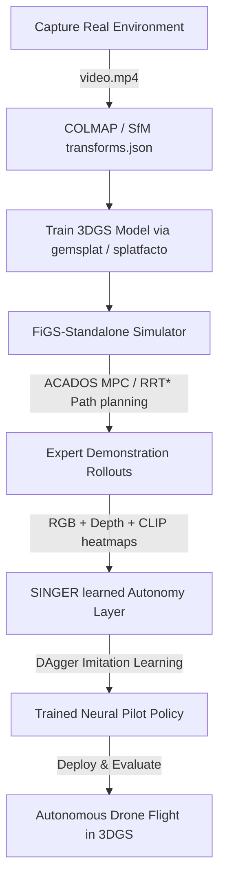

# V-LEAD: Drone Autonomy in 3D Gaussian Splats

Welcome to **V-LEAD**, a specialized quadcopter autonomy and simulation framework compiled for the Stanford **cs231n** project. 

V-LEAD integrates physics-accurate drone simulation with visual-language navigation policy training inside photorealistic **3D Gaussian Splatting (3DGS)** environments.

---

## 🗺️ Framework Overview

V-LEAD is composed of two primary sub-systems (integrated via Git submodules) and structured operator guides:



### Core Components:
1. **[FiGS-Standalone](FiGS-Standalone)** (*Flight in Gaussian Splats*): A physics-accurate quadcopter simulator flying through 3D Gaussian Splat environments. It handles rigid-body dynamics (via ACADOS ODE solvers), MPC expert controllers, RRT* trajectory planning, and high-fidelity multi-channel rendering (RGB, depth, and CLIP-semantic maps).
2. **[SINGER](SINGER)** (*Scene Understanding via Synthesized Visual Inertial Data from Experts*): The learned imitation policy layer. It trains neural pilots (HistoryEncoder + VisionMLP + CommanderSV) to navigate complex environments via DAgger-style imitation learning from expert demonstrations.

---

## 📚 Operator Guides & Documentation

To get started, reference these comprehensive guides included in this repository:

| Guide / Reference | Purpose | Target Audience |
| :--- | :--- | :--- |
| 📖 **[LEAD Instructions](LEAD_instructions.md)** | Step-by-step guide to run the full neural policy training pipeline, environment setup, and `Semantic_HSM` training. | Users & Policy Researchers |
| 🎮 **[FiGS Guide](FiGS_instructions.md)** | Complete simulator operator guide covering 3DGS training, perception modes, ACADOS flight control parameters, and rendering. | Simulator Operators & Control Engineers |


---

## 📁 Repository Structure

```
V-LEAD/
├── FiGS-Standalone/       # Submodule: Simulator, MPC Control, & 3DGS Rendering
├── SINGER/                # Submodule: DAgger training pipeline & Imitation Policies
├── AGENT_CONTEXT.md       # AI Architect blueprints & developer map
├── LEAD_instructions.md   # Setup & pipeline instructions for training pilots
├── FiGS_instructions.md   # Reference guide for Splat training and simulation
├── LICENSE                # Project licensing
└── README.md              # This directory overview
```

---

## ⚡ Quick Start Reference

### 1. Run the Drone Simulator
To enter the simulator environment and run a flight demo:
```bash
cd FiGS-Standalone
docker compose -f docker-compose.base.yml run --rm figs
# Inside the container:
python3 notebooks/figs_simulate_flight_example.py
```
*Creates a simulated flight recording at `test_space/track_spiral_flightroom_ssv_exp.mp4`.*

### 2. Run SINGER Policy Training
To enter the training container and run the full neural pilot pipeline:
```bash
cd SINGER
docker compose run --rm singer
# Inside the container:
# Step 1: Generate expert rollouts
python3 notebooks/ssv_multi3dgs_campaign.py generate-rollouts --config-file configs/experiment/smoke_test.yml
# Step 2: Train history encoder
python3 notebooks/ssv_multi3dgs_campaign.py train-history --config-file configs/experiment/smoke_test.yml
# Step 3: Train policy commander
python3 notebooks/ssv_multi3dgs_campaign.py train-command --config-file configs/experiment/smoke_test.yml
```

---

